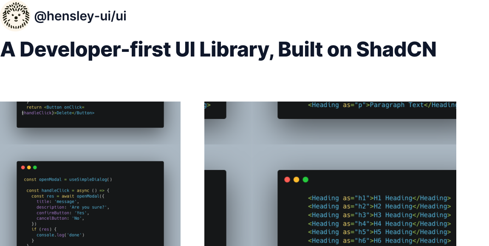

# 🦔 @hensley/ui-ui React component library &middot;

[](https://badge.fury.io/js/@hensley-ui%2Fui)

## Language

- [English](README.en.md)

## 프로젝트 소개

HensleyUI는 **Radix UI**와 **ShadCN 디자인 시스템**을 기반으로 구축된 **React UI 라이브러리**입니다. 이 라이브러리는 **Polymorphic 컴포넌트**를 제공하여 유연한 UI 설계를 지원하며, **ShadCN 디자인 시스템**의 철학을 반영한 **일관성 있는 디자인**을 제공합니다.

### 주요 목표

---

- **Radix UI**의 접근성 좋은 UI 컴포넌트와 **ShadCN 디자인 시스템**의 아름답고 일관성 있는 디자인 스타일을 결합하여, 쉽게 커스터마이징 가능한 컴포넌트를 제공합니다.
- **Polymorphic 컴포넌트**를 통해 다양한 HTML 요소로 변환할 수 있는 유연성을 제공합니다.

## 설치

---

```bash
npm install @hensleyui/ui-ui
```

## 예제

---

### Heading

```tsx
export const AllHeadingLevels: Story = {
  render: () => (
    <div className="space-y-4">
      <Heading as="h1">H1 Heading</Heading>
      <Heading as="h2">H2 Heading</Heading>
      <Heading as="h3">H3 Heading</Heading>
      <Heading as="h4">H4 Heading</Heading>
      <Heading as="h5">H5 Heading</Heading>
      <Heading as="h6">H6 Heading</Heading>
      <Heading as="p">Paragraph Text</Heading>
    </div>
  ),
};
```

## 비동기 다이얼로그 열기

```tsx
export const SimpleDialog = () => {
  const openModal = useSimpleDialog();

  const handleClick = async () => {
    const res = await openModal({
      title: "",
      confirmButton: "확인",
      cancelButton: "취소",
      ...props,
    });
    if (res) {
      console.log("done");
    }
  };
  return <Button onClick={handleClick}>다이얼로그 열기</Button>;
};
```

## Contributing

추후에 기여 방법에 대한 안내를 추가할 예정입니다. 감사합니다.

## License

이 프로젝트는 MIT License를 따릅니다.
